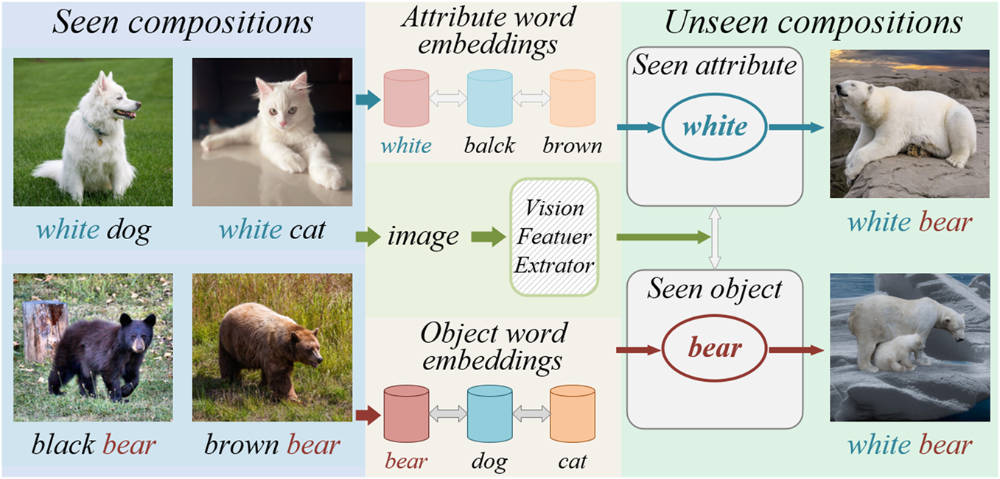

# AOGN-CZSL: an Attributes and Objects Guided Network for Compositional Zero-Shot Learning

This is the official PyTorch code for the paper:

**AOGN-CZSL: an Attributes and Objects Guided Network for Compositional Zero-Shot Learning，Information Fusion (revision)**

**Jing Yang**, **Xingjiang Ma**, **Yuankai Wu**, **Chengjiang Li**, **Zhidong Su**, **Ji Xu**, **Yixiong Feng**

**[**Paper**](https://...)**|**[**Code**](https://github.com/mxjmxj1/AOGN)**

<p align="center">
  
</p>


## Setup

The model code is implemented based on the PyTorch framework. The experimental environment includes:

- Ubuntu20.04

- Intel(R) Core(TM) i7-12700K CPU
- 128GB RAM
- NVIDIA GeForce RTX 3090Ti GPU

Create a conda environment `aogn` using:

```
conda env create -f environment.yml
conda activate aogn
```

## Preparation

The datasets C-GQA and UT-Zappos50K used in our work need to be prepared before training and testing the model. They can be downloaded through a script:

```
bash utils/download_data.sh
```

The two datasets Clothing16K and Vaw-CZSL can be downloaded by clicking [here](https://drive.google.com/drive/folders/1LaJnfVv-xjsr87mhgMAtMZ5tfo3v7DLZ?usp=drive_link).

In our method, since we use the pre-trained ViT (Vision Transformer) as the backbone network of the image feature extractor, we need to load the pre-training file before starting the training. DINO pretrained ViT-B-16 can be found [here](https://drive.google.com/drive/folders/1rVLvgss6zVzQwkWbO0GA-PXXHbGg3yRN?usp=drive_link).

## Training

**Closed World.** To train  AOGN-CZSL model, the command is simply:

```
    python train.py --config CONFIG_FILE
```

where `CONFIG_FILE` is the path to the configuration file of the model 

For example, we train AOGN-CZSL on the dataset C-GQA in a closed world scenario:

```
    python train.py --config configs/cgqa-cw.yml
```

**Open World.** To train AOGN-CZSL in the open world scenario, you only need to set the `open-world`  parameter in the configuration file `CONFIG_FILE` to `True`.

## Test

After the above training, a `logs` file will be generated, which contains logs, model parameters and checkpoints. We can test our model through this `logs` file.

 For example, testing AOGN-CZSL on the C-GQA dataset:

```
python test.py --logpath LOG_DIR
```

where `LOG_DIR` is the directory containing the logs of a model.

## References

If you use this code in your research, please consider citing our paper:

```
@article{,
  title={AOGN-CZSL: an Attributes and Objects Guided Network for Compositional Zero-Shot Learning},
  author={Jing Yang, Xingjiang Ma, Yuankai Wu, Chengjiang Li, Zhidong Su, Ji Xu, Yixiong Feng},
  booktitle={},
  year={},
  organization={}
}
```

**Note:** Our work is based on  [CZSL](https://github.com/ExplainableML/czsl).  If you find those parts useful, please consider citing:

```
@inproceedings{naeem2021learning,
  title={Learning Graph Embeddings for Compositional Zero-shot Learning},
  author={Naeem, MF and Xian, Y and Tombari, F and Akata, Zeynep},
  booktitle={34th IEEE Conference on Computer Vision and Pattern Recognition},
  year={2021},
  organization={IEEE}
}
```

and the feature extractor backbone network we use is partly derived from [ADE](https://github.com/haoosz/ade-czsl):

```
@InProceedings{hao2023ade,
  title={Learning Attention as Disentangler for Compositional Zero-shot Learning},
  author={Hao, Shaozhe and Han, Kai and Wong, Kwan-Yee K.},
  booktitle={CVPR},
  year={2023}
  }
```

Thanks for open source!

**If you have any questions you can contact us : gs.xjma22@gzu.edu.cn or jyang23@gzu.edu.cn**
